# Azure KeyVault

The Azure KeyVault Orchestrator allows for management of certificates within an Azure Key Vault. Inventory and Management functions are supported.

#### Integration status: Production - Ready for use in production environments.

## About the Keyfactor Windows Orchestrator AnyAgent

This repository contains a Windows Orchestrator AnyAgent, which is a plugin to the Keyfactor Windows Orchestrator. Within the Keyfactor Platform, Orchestrators are used to manage “certificate stores” &mdash; collections of certificates and roots of trust that are found within and used by various applications.

The Windows Orchestrator is part of the Keyfactor software distribution and is available via the Keyfactor customer portal. For general instructions on installing AnyAgents, see the “Keyfactor Command Orchestrator Installation and Configuration Guide” section of the Keyfactor documentation. For configuration details of this specific AnyAgent, see below in this readme.

Note that in Keyfactor Version 9, the Windows Orchestrator have been replaced by the Universal Orchestrator. While this AnyAgent continues to work with the Windows Orchestrator, and the Windows Orchestrator is supported alongside the Universal Orchestrator talking to Keyfactor version 9, AnyAgent plugins cannot be used with the Universal Orchestrator.

---

---

## Setup and Configuration

The high level steps required to configure the Azure Keyvault Orchestrator extension are:

1) [Configure the Azure Keyvault for client access](#configure-the-azure-keyvault-for-client-access)

1) [Create the Store Type in Keyfactor](#create-the-store-type-in-keyfactor)

1) [Install the Extension on the Orchestrator](#install-the-extension-on-the-orchestrator)

1) [Create the Certificate Store](#create-the-certificate-store)

### Configure the Azure Keyvault for client access

To provision access to the Keyvault instance, we will:

1) [Create a Service Principal in Azure Active Directory](#create-a-service-principal)

1) [Assign it sufficient permissions for Keyvault operations](#assign-permissions)

1) [Generate an Access Token for Authenticating](#generate-an-access-token)

1) [Store the server credentials in Keyfactor](#store-the-server-credentials-in-keyfactor)

#### Create a Service Principal

For the Orchestrator to be able to interact with the instance of Azure Keyvault, we will need to create an entity in Azure that will encapsulate the permissions we would like to grant it.  In Azure, these intermediate entities are referred to as app registrations and they provision authority for external application access.
To learn more about application and service principals, refer to [this article](https://docs.microsoft.com/en-us/azure/active-directory/develop/howto-create-service-principal-portal).

**In order to complete these steps, you must have the _Owner_ role for the Azure subscription, at least temporarily.**
This is required to create an App Registration in Azure Active Directory.

1) Log into [your azure portal](https://portal.azure.com)

1) Navigate to [Azure active directory](https://portal.azure.com/#blade/Microsoft_AAD_IAM/ActiveDirectoryMenuBlade/Overview) in the portal.

1) Select "App registrations" from the menu.

1) Click "+ New registration"

1) Give it a name such as "keyfactor-akv" and leave the first radio button selected

     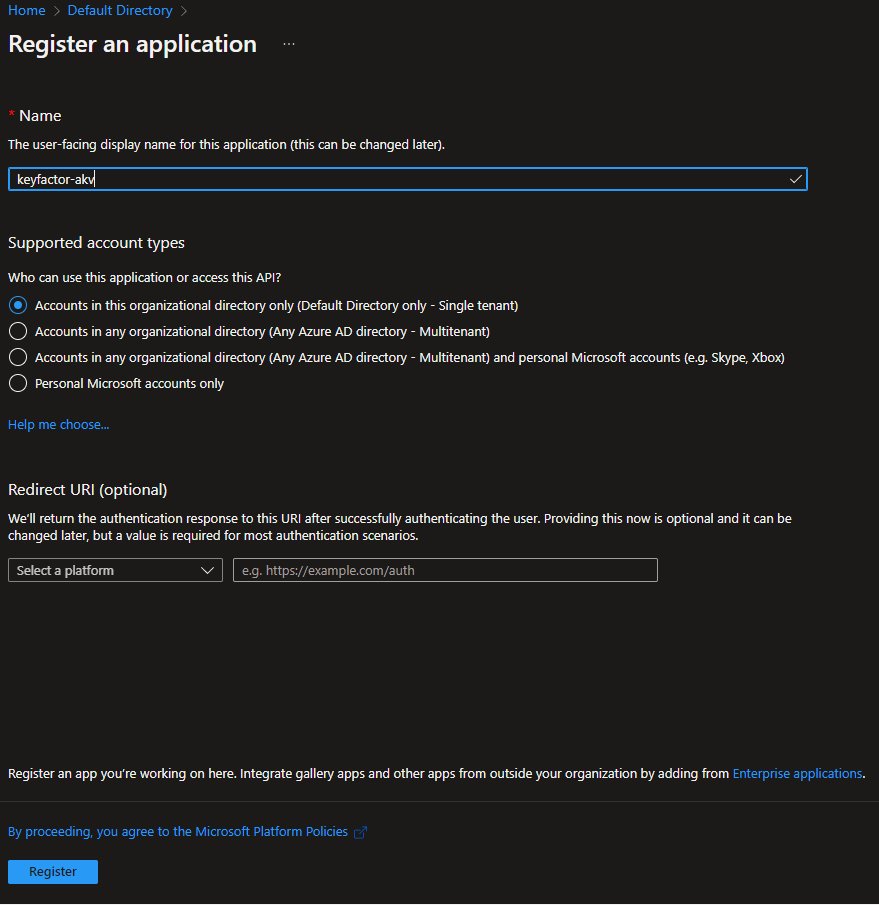

1) Once the entity has been created, you should be directed to the overview view.

     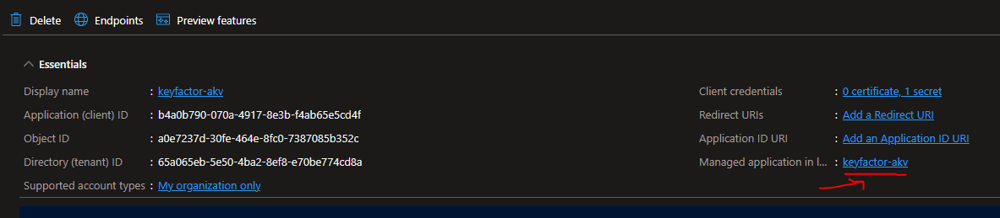

1) From here, copy the _Directory (tenant) ID_.

1) Click on the underlined link above.  You should see the managed application details that look similar to the below screen shot.

     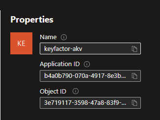

1) Copy the _Application (client) ID_, _Object ID_.

1) Now we have a App registration and values for  _Directory (tenant) ID_, _Application (client) ID_ and _Object ID_.  These will be used by the integration for authentication to Azure.

#### Assign Permissions

In order to be able to discover and create new Azure Keyvault certificate stores, the app principal that we created must be provided with the "Keyvault Administrator" role at the _Resource Group_ level.[^1]
_If there are multiple resource groups that will contain Key Vaults to be managed, you should repeat for each._

Here are the steps for assigning this role.

1) Navigate to the Azure portal and select a resource group that will contain the Keyvaults we would like to manage.
1) Select "Access control (IAM)" from the left menu.
1) Click "Add", then "Add Role Assignment" to create a new role assignment

     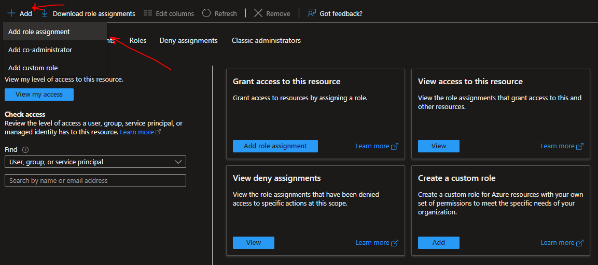
1) Search and Select the "Key Vault Administrator" role.
1) Search and Select the principal we created.

     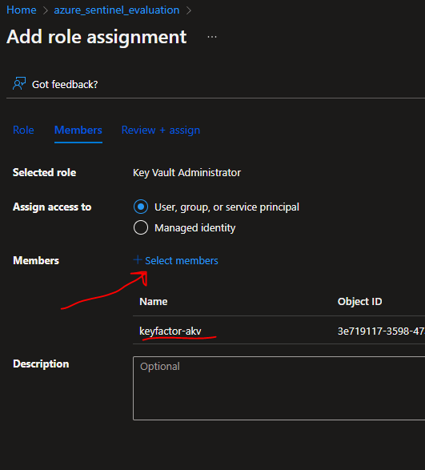
1) Click "Review and Assign" and save the role assignment.

[^1]: If discovery and create store functionality are not neeeded, it is also possible to manage individual certificate stores without the need to provide resource group level authority.  The steps to do assign permissions for an individual Azure Keyvault are described [here](#assign-permissions-for-an-individual-key-vault-via-access-policy) for vaults using Access Policy based permissions and [here](#assign-permissions-for-an-individual-key-vault-via-rbac) for Individual Key Vaults using Role-Based Access Control (RBAC).

#### Assign Permissions for an Individual Key Vault via RBAC

If you only need to manage a single instance of a Key Vault and do not require creation and discovery of new Key Vaults, you can provision access to the specific instance without needing to provide the service principal the "Keyvault Administrator" role at the resource group level.

Follow the below steps in order to provide management access for our service principal to a specific instance of a Key Vault:

1) Navigate to the Azure Portal and then to your instance of the Azure Keyvault

1) Go to "Access control (IAM)" in the navigation menu for the Key vault.

1) Click on "Add role assignment"

     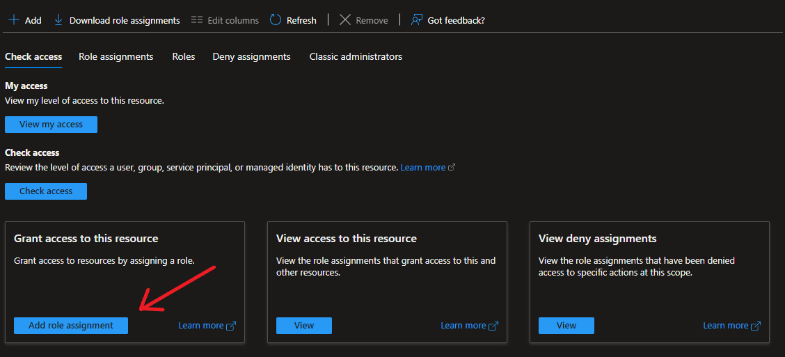

1) Find the Keyvault Administrator role in the list.  Select it and click "Next"

    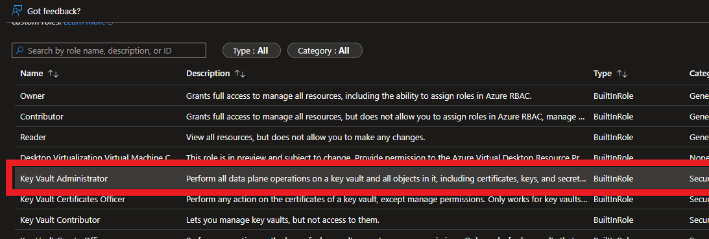

1) On the next screen, click "Select members" and then search for the service principal we created above.

    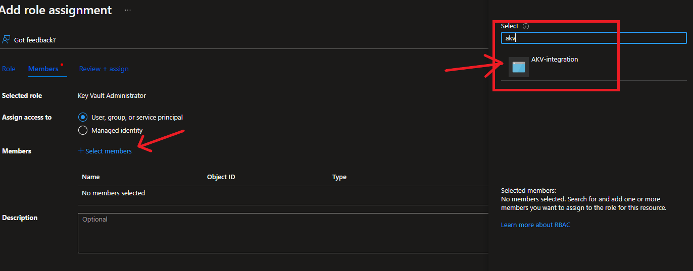

 1) Select the service principal, click "select", and then "Next"

 1) On the final screen, you should see something similar to the following:

     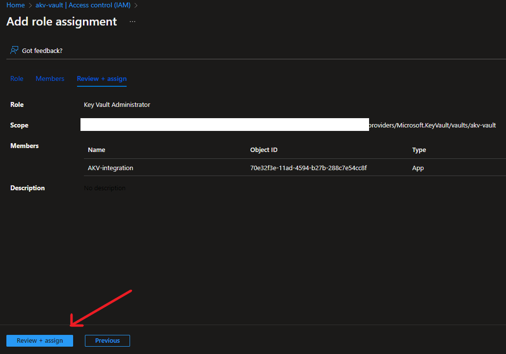

 1) Click "Review + assign" to finish assigning the role of Keyvault Administrator for this Key Vault to our service principal account.

#### Assign Permissions for an Individual Key Vault via Access Policy

Access to an Azure Key Vault instance can be granted via Role Based Access Control (RBAC) or with class Azure Resource Access Policies.  The below steps are for provisioning access to a single 
instance of a Key Vault using Access Policies.  If you are using RBAC at the resource group level (necessary for discovery and creating new Key Vaults via Keyfactor) we recommend following RBAC (above).  Alternatively, you will need to assign explicit permissions to the service principal for any Key Vault that is using Access Policy for Access Control if the Key Vault should be managed with Keyfactor.

Following the below steps will provide our service principal with the ability to manage keys in an existing vault, without providing it the elevated permissions required for discovering existing vaults or creating new ones.  If you've completed the steps in the previous section for the resource group that contains the Key Vault(s) you would like to manage and the Key Vault(s) are using RBAC, the below steps are not necessary.

1) Navigate to the Azure Portal and then to your instance of the Azure Keyvault.

1) Go to "Access Policies" in the navigation menu for the Key vault.

1) Click "+ Add Access Policy"

1) In the first drop-down, you can select "Certificate Management".  This will select all certificate management permissions.

     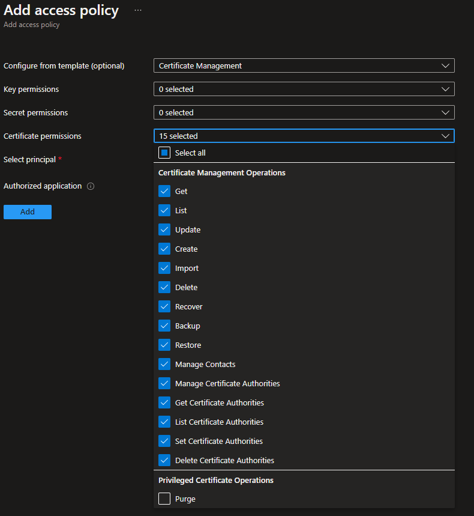

1) Click "Select Principal" to open the search pane.

1) Find the Application Registration we created above, select it, and click "Select".

     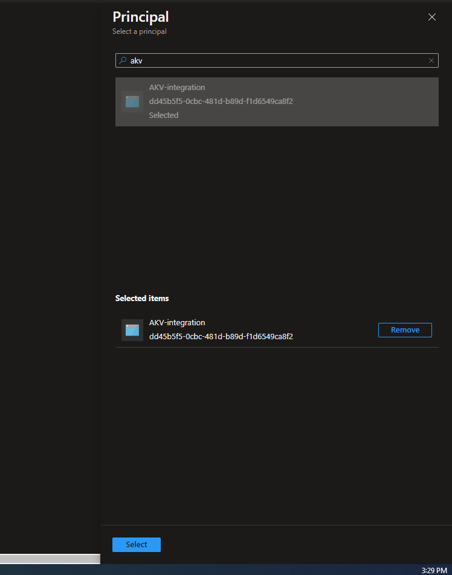

1) Leave "Authorized application" unselected.

1) Click "Add".

1) After you are redirected to the "Access policies" view, you should see the App Registration listed under "APPLICATION".

1) Click "Save" at the top of this view.

     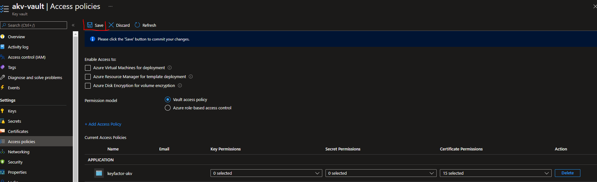

#### Generate an Access Token

For authenticating to Azure via our App Registration, we will need to generate an access token.

1) Navigate to the App Registration we created earlier, in Azure Active Directory.
1) Select "Certificates & Secrets" from the left menu.
1) Click "+ New client secret"
1) Give it a description such as "Keyfactor access"
1) Select a valid expiration
1) Click "Add".
1) Copy the "Value" of the secret before navigating away.

Now we have our App registration created in Azure, and we have the following values

- _TenantId_
- _ApplicationId_
- _ObjectId_
- _ClientSecret_

We will store these values securely in Keyfactor in subsequent steps.

### Create the Store Type in Keyfactor

In Keyfactor Command create a new Certificate Store Type similar to the one below:

- **Name** – Required. The display name of the new Certificate Store Type
- **Short Name** – Required. **MUST** be &quot;AKV&quot;
- **Needs Server, Blueprint Allowed, Requires Store Password, Supports Entry Password** – All unchecked as shown
- **Supports Custom Alias** – Optional. Not used.
- **Use PowerShell** – Unchecked
- **Store PathType** – Freeform (user will enter the the location of the store). Format =\> [_VaultName_].vault.azure.net. See &quot;VaultName&quot; under &quot;Custom Parameters&quot; below.
- **Private Keys** – Required (a certificate in a Azure Key Vault will contain a private key)
- **PFX Password Style** – Default
- **Job Types** – Inventory, Add, Remove, Create and Discovery are the job types implemented by this AnyAgent
- **Custom Parameters** :
  - **TenantID** – Required **.** The ID of the Azure Active Directory (obtained from Properties menu of the subscription&#39;s Azure Active Directory – on this page it is called &quot;Directory ID&quot;)
  - **ResourceGroupName** – Required **.** The resource group name to which the Key Vault(s) belong. Can be found by clicking on the vault being managed and finding the &quot;Resource group&quot; at the top of the page.
  - **ApplicationId** – Required **.** The ID of the API Application you are using to communicate with the Azure Key Vault (obtained from the App registration found under the App registrations menu of the subscription&#39;s Azure Active Directory)
  - **ClientSecret** – Required **.** The secret value given to you when you created a key for the API application.
  - **SubscriptionId** – Required **.** The ID of the subscription the Azure Key Vault(s) reside in (obtained from the Properties menu of the Subscription under the Subscriptions menu)
  - **APIObjectId** – Required **.** The object ID of the API Application.  This is found by searching for your app in "Enterprise Applications" (Object Id).  This value may be different than the one found in "App Registrations".  Use the Enterprise one. 
  - **VaultName** – Required **.** The name of the vault being managed.

#### Adding Custom Parameters

Next to the parameters listbox in the Certificate Store Types dialog, click the \<ADD\> button. You should see the dialog below, with the values for TenantId filled in:

- **Name** – Required **.** For each parameter _ **must** _ match the name shown above.
- **Display Name** – Required. The label that will show when adding or editing a specific AKV certificate store.
- **Type** – Required. Will be &quot;string&quot; for all of the above.
- **Required** – Checked for all parameters above.
- **Depends On Other** – Unchecked for all parameters above.
- **Default Value** – Leave blank for all parameters above.

### Install the Extension on the Orchestrator

Open the Keyfactor Windows Agent Configuration Wizard and perform the tasks as illustrated below:

- Click **\<Next\>**

- If you have configured the agent service previously, you should be able to skip to just click **\<Next\>.** Otherwise, enter the service account Username and Password you wish to run the Keyfactor Windows Agent Service under, click **\<Update Windows Service Account\>** and click **\<Next\>.**

- If you have configured the agent service previously, you should be able to skip to just re-enter the password to the service account the agent service will run under, click **\<Validate Keyfactor Connection\>** and then **\<Next\>.**

- Select the agent you are adding capabilities for (in this case, Azure Key Vault, and also select the specific capabilities (Inventory and Management in this example). Click **\<Next\>**.

- For agent configuration purposes, this screen can be skipped by clicking **\<Next\>**.

- For each AnyAgent implementation, check **Load assemblies containing extension modules from other location** , browse to the location of the compiled AnyAgent dlls, and click **\<Validate Capabilities\>**. Once all AnyAgents have been validated, click **\<Apply Configuration\>**.

- If the Keyfactor Agent Configuration Wizard configured everything correctly, you should see the dialog above.

**3. Create an AKV Certificate Store within Keyfactor Command**

Navigate to Certificate Locations =\> Certificate Stores within Keyfactor Command to add an Azure Key Vault certificate store. Below are the values that should be entered.

- **Category** – Required. The Azure Key Vault category name must be selected.
- **Container** – Optional. Select a container if utilized.
- **Client Machine** – Required. The server name or IP Address where the agent is running.
- **Store Path** – Required. Format =\> [_VaultName_].vault.azure.net. See &quot;VaultName&quot; under &quot;Custom Parameters&quot; under _ **1. Create the New Certificate Store Type for the New AKV AnyAgent** _.
- **TenantID** – Required **.** The ID of the Azure Active Directory (obtained from Properties menu of the subscription&#39;s Azure Active Directory – on this page it is called &quot;Directory ID&quot;)
- **ResourceGroupName** – Required **.** The resource group name to which the Key Vault(s) belong. Can be found by clicking on the vault being managed and finding the &quot;Resource group&quot; at the top of the page.
- **ApplicationId** – Required **.** The ID of the API Application you are using to communicate with the Azure Key Vault (obtained from the App registration found under the App registrations menu of the subscription&#39;s Azure Active Directory)
- **ClientSecret** – Required **.** The secret value given to you when you created a key for the API application.
- **SubscriptionId** – Required **.** The ID of the subscription the Azure Key Vault(s) reside in (obtained from the Properties menu of the Subscription under the Subscriptions menu)
- **APIObjectId** – Required **.** The object ID of the API Application.  This is found by searching for your app in "Enterprise Applications" (Object Id).  This value may be different than the one found in "App Registrations".  Use the Enterprise one. 
- **VaultName** – Required **.** The name of the vault being managed.
- **Create Certificate Store** – Unchecked **.**
- **Inventory Schedule** – Set a schedule for running Inventory jobs or none, if you choose not to schedule Inventory at this time.

***

**Talking Points**

- While Azure Key Vault will automatically renew certs from DigiCert, GlobalSign, and D-Trust, they only send emails for certificates from other certificate providers
- You have the option to specify that the key pair be generated as non-exportable and generated inside an HSM. If you do this then you cannot distribute your certificate and private key to your app nodes as illustrated in the end-to-end flow example above.
- The Azure App Services platform periodically polls your key vault to check if there is an updated certificate. If it finds one it reads the new one and rebinds SSL/TLS for your app.
 
 **Packages**

- GAC
  - System.Net.Http
  - System.Security.Cryptography.X509Certificates
  - System.Threading.Tasks
- NuGet
  - Microsoft.Azure.KeyVault v3.0.0 ([https://github.com/Azure/AutoRest](https://github.com/Azure/AutoRest))
  - Newtonsoft.Json.Linq v6.0.0 (Dependency from above)
  - Microsoft.IdentityModel.Clients.ActiveDirectory v3.19.8 ([https://aka.ms/adalnet](https://aka.ms/adalnet))
  - Microsoft.AspNet.WebApi.Client v5.2.3 ([https://www.asp.net/web-api](https://www.asp.net/web-api))
  - Microsoft.Azure.Management.KeyVault v2.4.1 ([https://github.com/Azure/azure-sdk-for-net](https://github.com/Azure/azure-sdk-for-net))
- CSS
  - CSS.CMS.Extensions.Agents;
  - CSS.PlatformServices;

***

### License
[Apache](https://apache.org/licenses/LICENSE-2.0)

