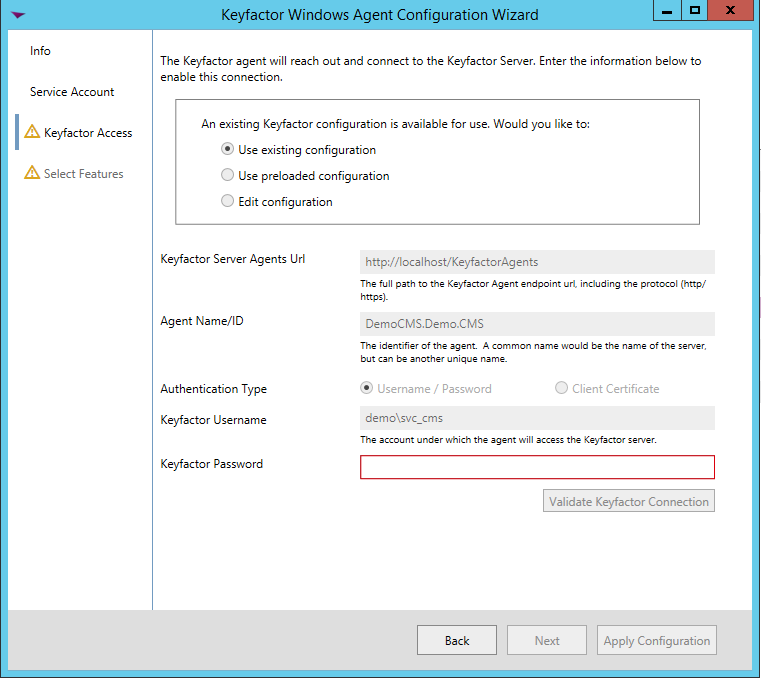

## **AKV AnyAgent Configuration**

**Overview**

The AKV AnyAgent allows a user to inventory, and manage (both add and remove) Azure Key Vault certificate stores.

**1. Create the New Certificate Store Type for the New AKV AnyAgent**

In Keyfactor Command create a new Certificate Store Type similar to the one below:

- **Name** – Required. The display name of the new Certificate Store Type
- **Short Name** – Required. **MUST** be &quot;AKV&quot;
- **Needs Server, Blueprint Allowed, Requires Store Password, Supports Entry Password** – All unchecked as shown
- **Supports Custom Alias** – Optional. Not used.
- **Use PowerShell** – Unchecked
- **Store PathType** – Freeform (user will enter the the location of the store). Format =\> [_VaultName_].vault.azure.net. See &quot;VaultName&quot; under &quot;Custom Parameters&quot; below.
- **Private Keys** – Required (a certificate in a Azure Key Vault will contain a private key)
- **PFX Password Style** – Default
- **Job Types** – Inventory, Add, and Remove are the 3 job types implemented by this AnyAgent
- **Custom Parameters** :
  - **TenantID** – Required **.** The ID of the Azure Active Directory (obtained from Properties menu of the subscription&#39;s Azure Active Directory – on this page it is called &quot;Directory ID&quot;)
  - **ResourceGroupName** – Required **.** The resource group name to which the Key Vault(s) belong. Can be found by clicking on the vault being managed and finding the &quot;Resource group&quot; at the top of the page.
  - **ApplicationId** – Required **.** The ID of the API Application you are using to communicate with the Azure Key Vault (obtained from the App registration found under the App registrations menu of the subscription&#39;s Azure Active Directory)
  - **ClientSecret** – Required **.** The secret value given to you when you created a key for the API application.
  - **SubscriptionId** – Required **.** The ID of the subscription the Azure Key Vault(s) reside in (obtained from the Properties menu of the Subscription under the Subscriptions menu)
  - **APIObjectId** – Required **.** The object ID of the API Application (obtained from the App registration found under the App registrations menu of the subscription&#39;s Azure Active Directory).
  - **VaultName** – Required **.** The name of the vault being managed.

**1a. Adding Custom Parameters**

Next to the parameters listbox in the Certificate Store Types dialog, click the \<ADD\> button. You should see the dialog below, with the values for TenantId filled in:

- **Name** – Required **.** For each parameter _ **must** _ match the name shown above.
- **Display Name** – Required. The label that will show when adding or editing a specific AKV certificate store.
- **Type** – Required. Will be &quot;string&quot; for all of the above.
- **Required** – Checked for all parameters above.
- **Depends On Other** – Unchecked for all parameters above.
- **Default Value** – Leave blank for all parameters above.

**2. Register the AKV AnyAgent with Keyfactor**

Open the Keyfactor Windows Agent Configuration Wizard and perform the tasks as illustrated below:

- Click **\<Next\>**

- If you have configured the agent service previously, you should be able to skip to just click **\<Next\>.** Otherwise, enter the service account Username and Password you wish to run the Keyfactor Windows Agent Service under, click **\<Update Windows Service Account\>** and click **\<Next\>.**

- If you have configured the agent service previously, you should be able to skip to just re-enter the password to the service account the agent service will run under, click **\<Validate Keyfactor Connection\>** and then **\<Next\>.**

- Select the agent you are adding capabilities for (in this case, Azure Key Vault, and also select the specific capabilities (Inventory and Management in this example). Click **\<Next\>**.

- For agent configuration purposes, this screen can be skipped by clicking **\<Next\>**.

- For each AnyAgent implementation, check **Load assemblies containing extension modules from other location** , browse to the location of the compiled AnyAgent dlls, and click **\<Validate Capabilities\>**. Once all AnyAgents have been validated, click **\<Apply Configuration\>**.

- If the Keyfactor Agent Configuration Wizard configured everything correctly, you should see the dialog above.

**3. Create an AKV Certificate Store within Keyfactor Command**

Navigate to Certificate Locations =\> Certificate Stores within Keyfactor Command to add an Azure Key Vault certificate store. Below are the values that should be entered.

- **Category** – Required. The Azure Key Vault category name must be selected.
- **Container** – Optional. Select a container if utilized.
- **Client Machine** – Required. The server name or IP Address where the agent is running.
- **Store Path** – Required. Format =\> [_VaultName_].vault.azure.net. See &quot;VaultName&quot; under &quot;Custom Parameters&quot; under _ **1. Create the New Certificate Store Type for the New AKV AnyAgent** _.
- **TenantID** – Required **.** The ID of the Azure Active Directory (obtained from Properties menu of the subscription&#39;s Azure Active Directory – on this page it is called &quot;Directory ID&quot;)
- **ResourceGroupName** – Required **.** The resource group name to which the Key Vault(s) belong. Can be found by clicking on the vault being managed and finding the &quot;Resource group&quot; at the top of the page.
- **ApplicationId** – Required **.** The ID of the API Application you are using to communicate with the Azure Key Vault (obtained from the App registration found under the App registrations menu of the subscription&#39;s Azure Active Directory)
- **ClientSecret** – Required **.** The secret value given to you when you created a key for the API application.
- **SubscriptionId** – Required **.** The ID of the subscription the Azure Key Vault(s) reside in (obtained from the Properties menu of the Subscription under the Subscriptions menu)
- **APIObjectId** – Required **.** The object ID of the API Application (obtained from the App registration found under the App registrations menu of the subscription&#39;s Azure Active Directory).
- **VaultName** – Required **.** The name of the vault being managed.
- **Create Certificate Store** – Unchecked **.**
- **Inventory Schedule** – Set a schedule for running Inventory jobs or none, if you choose not to schedule Inventory at this time.

#### Azure Documentation - Reference Only

**Packages**

- GAC
  - System.Net.Http
  - System.Security.Cryptography.X509Certificates
  - System.Threading.Tasks
- NuGet
  - Microsoft.Azure.KeyVault v3.0.0 ([https://github.com/Azure/AutoRest](https://github.com/Azure/AutoRest))
  - Newtonsoft.Json.Linq v6.0.0 (Dependency from above)
  - Microsoft.IdentityModel.Clients.ActiveDirectory v3.19.8 ([https://aka.ms/adalnet](https://aka.ms/adalnet))
  - Microsoft.AspNet.WebApi.Client v5.2.3 ([https://www.asp.net/web-api](https://www.asp.net/web-api))
  - Microsoft.Azure.Management.KeyVault v2.4.1 ([https://github.com/Azure/azure-sdk-for-net](https://github.com/Azure/azure-sdk-for-net))
- CSS
  - CSS.CMS.Extensions.Agents;
  - CSS.PlatformServices;

**Azure Configuration**

1. Create a new Azure Key Vault
  1. Select (All networks can access, unless you plan to configure routing rules and firewalls – not covered)
2. Collect the base Key Vault URL (available as the DNS Name under the details of the Key Vault resource)
3. Register a new API Application in AAD
  1. Use a URL like [https://localhost:44313](https://localhost:44313/), you won&#39;t need this
4. Add a key to the API Application created in (2)
  1. Save this key, it disappears after navigating away from the save page
5. Collect the Tenant ID (Also called Directory ID available under AAD -\> Properties)
6. Collect the API Application ID (Details of the API Application Registration in AAD)
7. Collect your Subscription ID (Details of your Subscription)
8. Add your API as a principal to your Key Vault resource
  1. Open the details of your Key Vault resource
  2. Click on Access Policies
  3. Click add new
  4. Ensure it has the proper permissions
  5. Select the application registered in (3) as the principal
  6. Click Ok
  7. Click Save
9. Add your API principal to your subscription
  1. Go to the subscription details
  2. Click on &quot;Access Control&quot;
  3. Click add
  4. Select &quot;Owner&quot;
  5. Select the principal of the application registered in (3)
  6. Click save

**Talking Points**

- While Azure Key Vault will automatically renew certs from DigiCert, GlobalSign, and D-Trust, they only send emails for certificates from other certificate providers
- You have the option to specify that the key pair be generated as non-exportable and generated inside an HSM. If you do this then you cannot distribute your certificate and private key to your app nodes as illustrated in the end-to-end flow example above.
- The Azure App Services platform periodically polls your key vault to check if there is an updated certificate. If it finds one it reads the new one and rebinds SSL/TLS for your app.